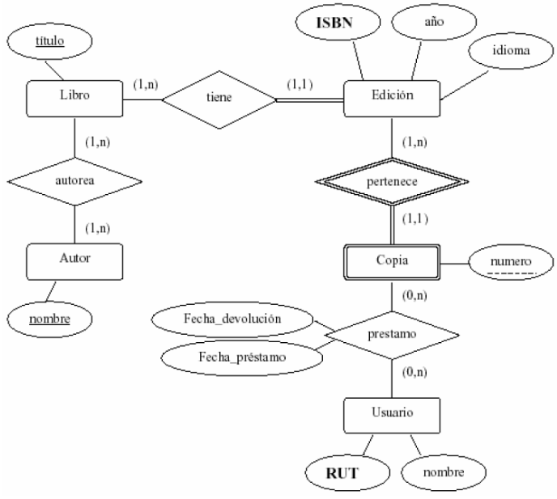

# db-proyecto-investigacion-2
Software de Desarrollo y driver para conectarse Base de datos No Relacional MongoDB

Este proyecto es una aplicación para gestionar una base de datos No Relacional en MongoDB, implementando operaciones CRUD para las entidades de una biblioteca, como autores, libros, usuarios, etc. Que pertenecen a un modelo entidad-relación dado.

## Objetivos
* Implementación y programación de un modelo de datos No relacional como resultado de requerimientos de un negocio.
* Afianzar los conocimientos de Diseño y modelamiento de bases de datos No relacionales a través de la implementación de un sistema de información apoyado con un motor de base de datos No relacional.

## Requerimientos:
* Pyhton
* Visual Studio Code
* Docker (Desktop)
* MongoDB
* Flask-PyMongo
* CustomTkinter
* dnspython

## Instrucciones de Uso
1. Ir al archivo "install.ipynb" e instalar todas las librerias de Python que el Usuario no tenga ya instalado.
2. Montar Mongodb en un contenedor de Docker. (Abrir cmd en la carpeta donde se encuentra el proyecto.)
    Commandos Docker:
    docker-compose up -d   -> Levantar el servicio con Docker Compose.
    docker-compose down    -> Detener el servicio. (Usar cuando ya se haya terminado el uso.)
3. Correr el "app.py"
